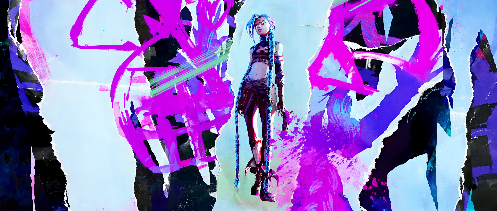
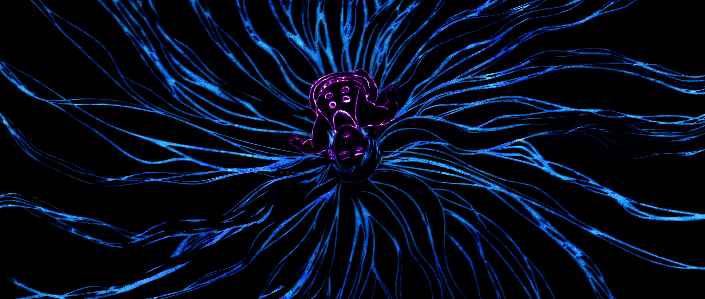
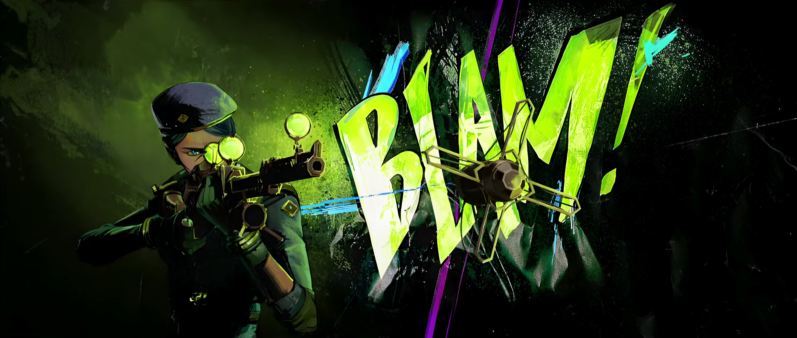
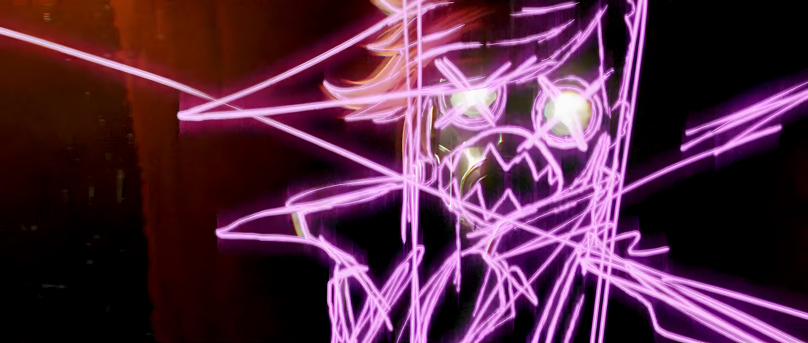
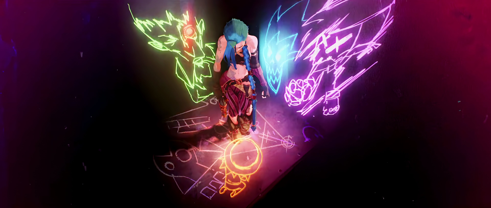
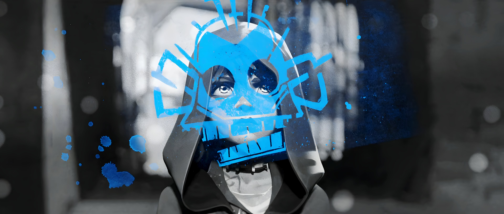

# xgao0847_9103_tut03
## Part 1: Imaging Technique Inspiration

In *Arcane*, I was inspired by two main visual techniques. The first is the transition from painterly 3D rendering to a bright, sketch-like hand-drawn style during emotionally intense moments. This contrast helps express inner tension more clearly. The second is the use of fluorescent graffiti lines over characters—especially Jinx—to show a chaotic or unstable mental state. I aim to recreate these layered and expressive visuals in my own work to reflect changes in mood or character.

---

### 🖌 Hand-drawn Style Variations

  
  

---

### 💥 Graffiti Overlay Variations

  
  
